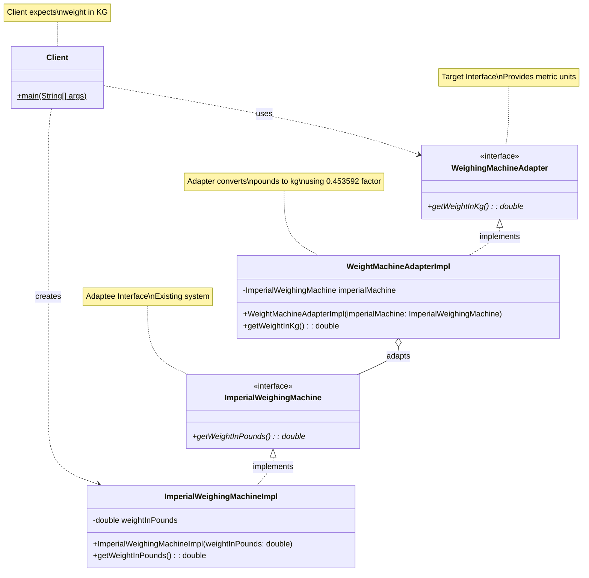
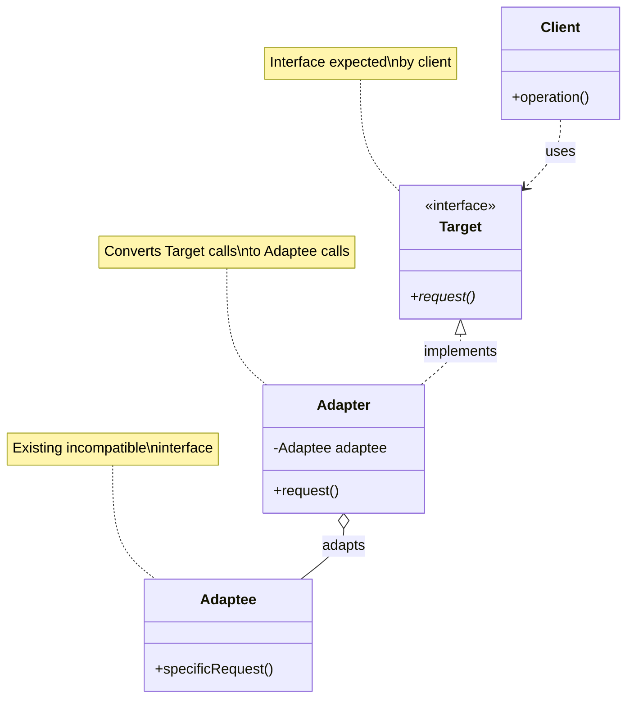
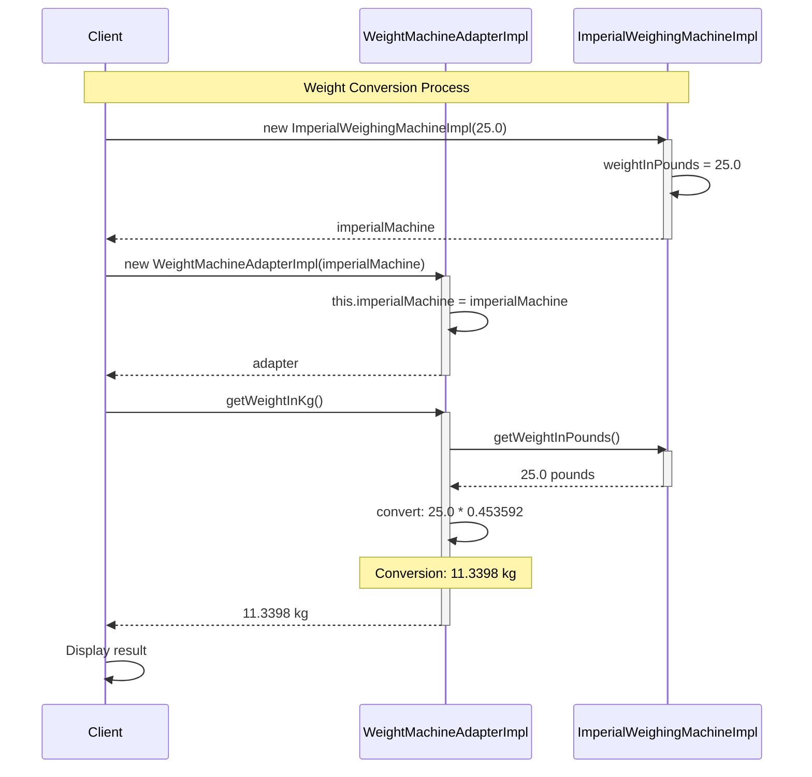
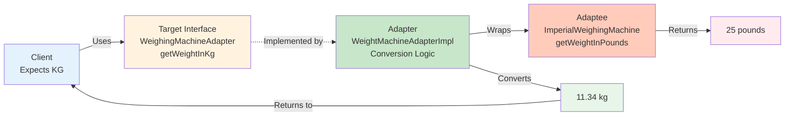
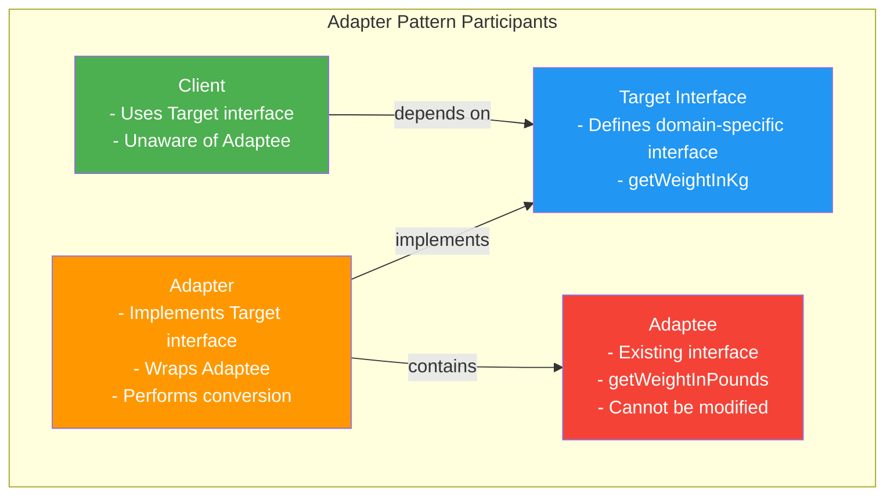
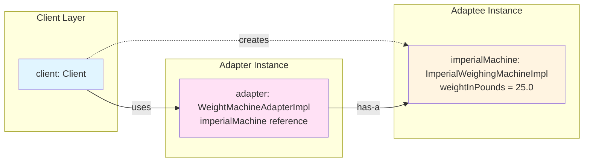

# Adapter Pattern - Weight Conversion System

**Type**: Structural Design Pattern

## Definition

**Adapter Pattern**: Convert the interface of a class into another interface clients expect. Adapter lets classes work together that couldn't otherwise because of incompatible interfaces.

**Purpose**: Bridge the gap between incompatible interfaces by wrapping an existing class with a new interface.

**Problem**: 
- Client expects weight in **kilograms (metric)**
- Existing system returns weight in **pounds (imperial)**
- Cannot modify the existing Imperial weighing machine

**Solution**: 
Create an adapter that converts pounds to kilograms, allowing client to work with the Imperial machine through a metric interface.

---

## UML Diagrams

### 1. Complete Class Diagram



---

### 2. Adapter Pattern Structure (Generic)



---

### 3. Sequence Diagram - Weight Conversion Flow



---

### 4. Component Interaction Diagram



---

### 5. Pattern Participants Diagram



---

### 6. Object Diagram - Runtime Instance



---

## Pattern Components

| Component | Role | Description |
|-----------|------|-------------|
| **Client** | User of Target interface | Expects weight in kilograms |
| **Target** | WeighingMachineAdapter | Interface client expects (metric) |
| **Adapter** | WeightMachineAdapterImpl | Converts pounds to kilograms |
| **Adaptee** | ImperialWeighingMachine | Existing system (imperial) |

---

## Key Relationships

| Relationship | Type | Description |
|--------------|------|-------------|
| Client → Target | Dependency | Client uses target interface |
| Adapter → Target | Implementation | Adapter implements target |
| Adapter → Adaptee | Composition | Adapter wraps adaptee |

---

## Conversion Formula

```
Weight in Kilograms = Weight in Pounds × 0.453592

Example:
25 pounds × 0.453592 = 11.3398 kilograms
```
